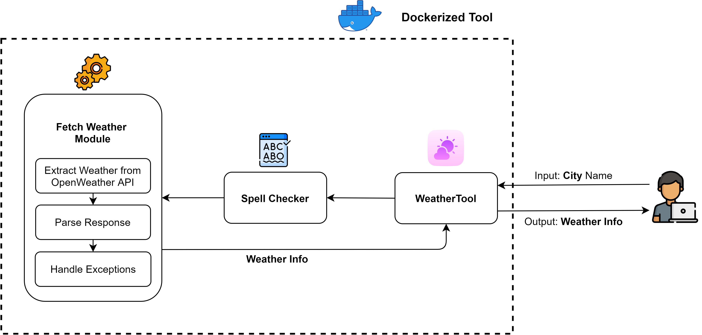

# weather-cli 

Command line tool powered by python code written with the help of comment driven develpoment backed by GitHub Copilot.

# Inspiration 


This tool is collaboratively developed for the [GitHub Copilot Hack in CodeGladiators 2023](https://www.techgig.com/codegladiators/github-copilot-hackathon) held by TechGig.

- [Tool Presentation](https://docs.google.com/presentation/d/1XZ_aivvg0hR2ARfoQQjU0ziPMjVuBPF6mMqtTAT57-8/edit?usp=sharing)

# Setup 

Clone the repository and run the following command:

```bash
docker build --tag weather-cli:latest .
```

# Usage 

```bash
docker run --rm -it weather-cli <city-name>
```

# Output 

```bash
docker run --rm -it weather-cli Pari
```

```bash
🔍 Initializing city name analysis...

Did you mean parit instead?

Press y for yes or n for no: n

Did you mean paris instead?

Press y for yes or n for no: y

✅  City name analysis complete! Name successfully resolved: Paris

🌤️  Engaging weather data retrieval protocol...

🌤️  Weather data acquisition successful! Here's what I found:
----------------------------------------------------------
{'city_name': 'Paris', 'temperature': '19.49°C', 'description': 'clear sky'}
----------------------------------------------------------
```

# Architecture 



# Team 

- Salil Gautam [@salil-gtm](https://github.com/salil-gtm)
- Gobilla Mothy [@G-Slient](https://github.com/G-Slient/)
- Kranthi Kiran [@kranthik13](https://github.com/kranthik13/)